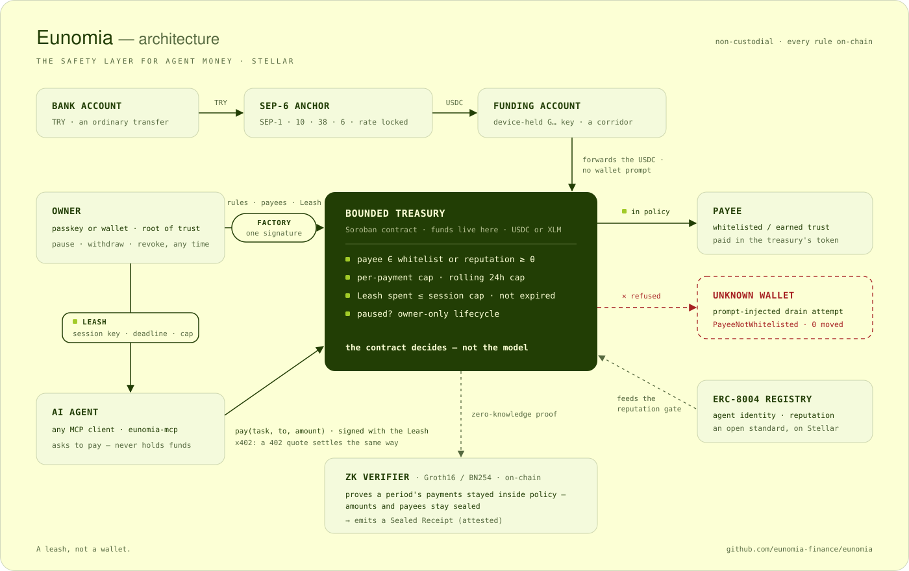

<div align="center">


# Eunomia

### The wallet your AI agent can't drain.

A non-custodial Soroban treasury that lets a business hand an autonomous AI agent **real money to spend** — where the **contract**, not the model's good behaviour, enforces the limits. The owner funds it with a bank transfer through a SEP-6 anchor, connects any MCP agent with one command, and every payment is checked, attributed and settled on Stellar in sub-cents.

<sub>**Formerly PRISM** — renamed to Eunomia ahead of mainnet. Hackathon results, tester evidence and on-chain history in this repo refer to the same product.</sub>

[](https://github.com/eunomia-finance/eunomia/actions/workflows/ci.yml)
[](https://www.npmjs.com/package/eunomia-mcp)


**[▶ Live app](https://eunomia.finance) · [📖 Docs](https://eunomia.finance/docs/) · [🎥 Demo video](https://youtu.be/R7mw9ZTh94U) · [🔌 Connect your agent](packages/mcp/README.md) · [🏦 The anchor leg](docs/ANCHOR.md) · [🗺 Roadmap](ROADMAP.md) · [📄 Deployment & proofs](DEPLOYMENT.md)**

</div>

---

## The problem

AI agents can reason, plan and act — right up until they need to **pay** for something. Today no business gives an LLM agent a wallet, for two reasons:

1. **Safety.** One hallucination, jailbreak or prompt-injection and the wallet is drained.
2. **Accounting.** An agent making hundreds of small payments is impossible to reconcile.

So agents "research and recommend" but never transact. Eunomia removes the blocker: the agent gets a **budget**, not the keys.

> **A leash, not a wallet.** An agent spends on a **Leash** — scoped, expiring authority — never with the keys to the vault.

## What it does

| | Guarantee | How |
|---|---|---|
| **Bound** | The agent can't overspend or pay the wrong address | The Soroban contract enforces a policy (payee whitelist · per-payment limit · rolling 24h limit) and **rejects violations on-chain** |
| **Revoke** | Authority ends on its own, or the moment the owner says so | The agent signs with a **Leash**: a session key with a spending cap and a deadline. The owner can revoke it, pause the treasury or withdraw at any time |
| **On-ramp** | The budget starts as ordinary money | TRY goes in through a **SEP-6 anchor** at a locked rate; the anchor's USDC lands inside the treasury, with no wallet prompt ([how](docs/ANCHOR.md)) |
| **Connect** | Any MCP agent can spend from it — Claude included | [`eunomia-mcp`](https://www.npmjs.com/package/eunomia-mcp): one command makes the agent's key, one signature puts it on the Leash |
| **Account** | Every payment is attributable, with zero overhead | Spend is tracked **per task** in the contract; read straight off-chain |
| **Earmark** | Money set aside for a specific agent budget, with no memos | A pool account issues **zero-cost muxed sub-addresses**; deposits attributed by `to_muxed_id` |
| **Trust** | The agent can pay counterparties the owner never listed, once they have earned it | A payee passes if **whitelisted OR** its on-chain ERC-8004 **reputation ≥ threshold** |
| **Outcome** | Pay only for delivered work | **Escrow** locks funds; released on approval, refunded after a deadline |
| **Prove** | Auditable without disclosure | Confidential mode proves a period's spending matched policy in zero-knowledge, [verified on-chain](https://stellar.expert/explorer/testnet/tx/426e55d6ce0a9157c156190cee39dc2a1d302cf4c7f4f98cc930da5ad63b4606) against the treasury's own totals |

The business keeps custody the whole time — funds live in the owner's own Soroban contract. Eunomia is the **guardrails + accounting + rail**, never the custodian.

**Vocabulary:** a **Leash** is the time-bound, spend-capped session key an agent signs with; a **Sealed Receipt** is the on-chain ZK attestation (the `attested` event) proving a payment stayed in policy without revealing the amount or the payee.

---

## How it works

The agent signs its own `pay(task, to, amount)`. The contract runs the policy gate, in order, on **every** call:

```
1. spender.require_auth()            the active session agent — else the root agent
2. not paused                        else  Paused               (#9)
3. session valid & within its cap    else  SessionExpired       (#11) / SessionCapExceeded (#12)
4. payee whitelisted OR reputation   else  PayeeNotWhitelisted  (#2)
5. amount ≤ per-payment limit        else  ExceedsTaskLimit     (#3)
6. 24h spend + amount ≤ daily limit  else  ExceedsDailyLimit    (#4)
7. balance sufficient                else  InsufficientBalance  (#5)
─────────────────────────────────────────────────────────────────
   write accounting → transfer → emit event
```

Rejections are the product working. A prompt-injected drain hits step 4 and reverts; funds never move.

## Architecture

<div align="center">

</div>

- **Owner** is the root of trust: creates the treasury, funds it, sets the rules, and can pause or withdraw at any time.
- **Treasury factory** does the whole setup under **one owner signature** — deploy, policy, first payee, Leash, funding, registry — atomically: if any part is refused, nothing is created.
- **Agent** never holds funds — it holds a **Leash**: time-bound, spend-capped, instantly revocable.
- **Treasury** (Soroban) enforces every rule on-chain: payee whitelist *or* earned ERC-8004 reputation, per-payment cap, rolling 24h cap, Leash limits, pause state. An out-of-policy payment reverts. It holds one token, fixed at creation — XLM, or the anchor's USDC.
- **Anchor leg**: TRY reaches the treasury through a SEP-6 anchor and a per-treasury funding account. Sequence and component diagrams: [`docs/ANCHOR.md`](docs/ANCHOR.md).
- **ZK verifier** (Groth16/BN254) proves a payment sat inside policy without revealing the amount or the payee, and emits a **Sealed Receipt**.
- **x402**: when a service answers `402 Payment Required`, the quoted charge settles through the same policy gate — an over-limit or wrong-payee quote never reaches settlement. A USDC treasury can settle USDC-priced x402 offers; the asset has to be the treasury's own.

## Connect your agent

[`eunomia-mcp`](https://www.npmjs.com/package/eunomia-mcp) is an MCP server and TypeScript SDK. The agent's key is made on the agent's machine and never leaves it; the owner only signs a cap and a deadline.

```bash
# 1 · on the agent's machine — makes the key, prints it and the MCP client config
npx -y eunomia-mcp init --treasury <C… treasury id>

# 2 · the owner pastes that key in the dashboard (Agent page) and signs once

# 3 · add the server to the MCP client — for Claude Code:
claude mcp add eunomia -e EUNOMIA_TREASURY=<C…> -e EUNOMIA_NETWORK=testnet -- npx -y eunomia-mcp
```

The dashboard prints command 1 with the treasury's id already in it — on the Agent page, and during setup too: a treasury's address follows from its salt, so the form settles it before the treasury exists, and **one signature creates the treasury and puts the agent on its Leash**.

| Tool | What the agent gets |
|---|---|
| `check_budget` | What it may spend right now — caps, 24h remainder, Leash, free balance, the `unit` the amounts are in — and, given an amount, the contract's own refusal codes ahead of time |
| `list_allowed_payees` · `check_payee` | Who the treasury will pay, each address re-verified on-chain |
| `pay` | A payment signed by the Leash key — `to` + `amount`, or an **x402** payment requirement. A refusal is not an error: it comes back with the stage and the contract's error code |
| `request_exception` · `check_exception` | Ask the owner for a payment the policy refuses; the owner resolves it on the dashboard with an on-chain action |

Full reference: [`packages/mcp/README.md`](packages/mcp/README.md). A run with the published package against a TRY-funded treasury, with transaction hashes: [`docs/ANCHOR.md`](docs/ANCHOR.md#verified-on-testnet-2026-09-18).

## Sign in with a passkey — no wallet, no seed, no XLM

A first-time user creates a treasury with **Face ID, a fingerprint or a device PIN**. Under the hood that is a WebAuthn passkey controlling a Stellar smart wallet (`passkey-kit`), and the treasury is deployed **by the wallet itself** so authority is bound to the user's own C-address. Transaction fees are sponsored, so nobody needs to hold XLM to get started. Browser wallets (Freighter, Albedo, LOBSTR via WalletConnect) work exactly as before.

## Fund it with TRY — through a SEP-6 anchor

A treasury can hold USDC and be filled with Turkish lira: the owner types an amount, gets bank details at a locked rate (SEP-38), and the anchor's USDC lands inside the treasury, where the agent spends it under the same rules. The integration is SEP-1 / SEP-10 / SEP-38 / SEP-6 against `tr-mock-anchor.fly.dev`; its only inputs are a home domain and an asset code, so a production SEP-6 anchor is a configuration change. The SEP-10 challenge is verified before it is signed, and adding funds needs no wallet prompt: a passkey owner goes from nothing to a funded treasury with one signature and without ever holding XLM (measured on the live site by `web/tests/e2e/passkey-try.live.spec.ts`).

The anchor is a testnet sandbox: its bank and KYC are simulated, its USDC and everything on the Stellar side are real. Architecture, the two constraints that shaped it, what is simulated and what is not, and the testnet evidence: [`docs/ANCHOR.md`](docs/ANCHOR.md).

---

## Live on testnet

| Contract | Address |
|---|---|
| Treasury factory (one-signature setup) | [`CAWLFTQ4…2OMS`](https://stellar.expert/explorer/testnet/contract/CAWLFTQ4V3ZPUWRVL5RGXBBA7FMJ26EXW37GGKCGKOXO4TKABEHF2OMS) |
| Treasury Registry | [`CBEPVXK6…4ZE7`](https://stellar.expert/explorer/testnet/contract/CBEPVXK6BN2FZ3IYHV5KQUGROFHNBWBYHKHRZ5U3O7UWGIOPFOFE4ZE7) |
| Treasury (v3, the guided demo's) | [`CAYWNXHA…SPAZ`](https://stellar.expert/explorer/testnet/contract/CAYWNXHANRY5GSJAZOR4YTKBKNOKTCITE52ZRKDKCAWLDTYWFFVFSPAZ) |
| Compliance Verifier (ZK, 16-payment batch) | [`CD3TB3F4…DYZ3`](https://stellar.expert/explorer/testnet/contract/CD3TB3F4VQF2H56IQC4KV3YLA6QRIF272W5D6PK2SWVTYPXHS4NFDYZ3) |
| Compliance Verifier (previous, holds the linked attestation) | [`CCZKA3K4…D5Q`](https://stellar.expert/explorer/testnet/contract/CCZKA3K4SPIFWG7UBIY2CE7LPKPMCWROCHXZO2JAMYVVGU6TUKOWMD5Q) |
| Treasury v2 (reputation + escrow) | [`CDKQGDPL…XT5H`](https://stellar.expert/explorer/testnet/contract/CDKQGDPLRX6DOCQTI5KVMZNGMPKMSRNGJRVCQ7LAAQGB2S5JKDCHXT5H) |
| ERC-8004 Identity Registry | [`CDE3K4CO…FIWZH`](https://stellar.expert/explorer/testnet/contract/CDE3K4COIAGWNNJQQLL26SYI3KBJF5FUDHXG5FA6GYDJCG7T5V7FIWZH) |
| Reputation Oracle (8004 stand-in) | [`CCJFIEYF…INKY`](https://stellar.expert/explorer/testnet/contract/CCJFIEYFNPRTJVCOGOSESYC5Z6FHHHYAH36V7QTZEDPKESY6O5TPINKY) |
| USDC the anchor pays out (SAC of `USDC:GBBD47IF…FLA5`) | [`CBIELTK6…DAMA`](https://stellar.expert/explorer/testnet/contract/CBIELTK6YBZJU5UP2WWQEUCYKLPU6AUNZ2BQ4WWFEIE3USCIHMXQDAMA) |
| USDC (SAC, the guided demo's rail) | [`CDCEHPK4…3Y2W`](https://stellar.expert/explorer/testnet/contract/CDCEHPK4OJXVRA4JV7N56GR5SRD5KGGZ55BDSHKODGR72Y4KGS6A3Y2W) |

Per-user treasuries are deployed by the factory and indexed by the registry, so they have no fixed address. Full addresses and verified on-chain results: [`DEPLOYMENT.md`](DEPLOYMENT.md).

## Testers & traction

Eunomia is used by people who are not us. Every treasury below was deployed by someone connecting their own wallet on testnet — no seeded accounts, no scripted users.

| | On testnet, as of 28 Jul 2026 |
|---|---|
| External testers | **14** — 12 with on-chain proof, 2 who explored and reported back |
| Treasuries deployed by testers | **13** (15 including ours) |
| Funding & payment transactions | **19** by testers (28 including ours), each recorded with its tx hash |
| Payments **blocked by the contract** | **13** by testers (20 including ours) — over-limit or non-whitelisted, funds never moved |

Usage is provable from two independent sources, neither of which we can quietly edit: the on-chain [TreasuryRegistry](https://stellar.expert/explorer/testnet/contract/CBEPVXK6BN2FZ3IYHV5KQUGROFHNBWBYHKHRZ5U3O7UWGIOPFOFE4ZE7), where each deploy registers its owner wallet, and a telemetry table recording every treasury action with its tx hash. Both are reconciled by [`web/scripts/user-count.mjs`](web/scripts/user-count.mjs) into [`docs/metrics/registered-users.json`](docs/metrics/registered-users.json), checked into the repo. Wallets made by our own end-to-end runs are listed in [`docs/metrics/e2e-exclude.json`](docs/metrics/e2e-exclude.json) and kept out of the count.

**Feedback signal from 11 external responses:** 4.9 / 5 average · 7 yes / 4 maybe on *would you use this in production*, none said no. What testers hit went straight into the product — the funding gate, "Copy ID", the sample-vendor prefill, the app shell and the treasury switcher all came from their reports.

**Tried Eunomia?** Tell us what to fix next: **[share feedback →](https://forms.gle/7gzJWwte52SmbXei7)**

## Built during Stellar Hacks: Real-World ZK

The bounded-treasury core predates the hackathon (built at IBW 2026). **Everything zero-knowledge — the entire Confidential layer — was designed and built inside the Stellar Hacks: Real-World ZK window (18–22 June 2026)**: the Circom compliance circuit (per-payment range + daily-sum bounds, Poseidon commitments, Poseidon-Merkle whitelist membership), the Groth16 trusted setup, and the on-chain BN254 verifier with a replay guard. It has since been rebuilt to bind proofs to chain state (2026-08-06) and widened to a 16-payment batch (2026-08-07).

Where the ZK is load-bearing: the [circuit](circuits/circuits/compliance.circom) proves the bounds *and* that the batch adds up to the treasury's own recorded total for the period, and the [on-chain verifier](contracts/compliance_verifier/src/lib.rs) runs the real BN254 pairing check through Soroban's native host functions after re-reading the policy and that total from the treasury — a valid proof over the real figures is the *only* way to produce an `attested` event. Proof: [live verify tx](https://stellar.expert/explorer/testnet/tx/426e55d6ce0a9157c156190cee39dc2a1d302cf4c7f4f98cc930da5ad63b4606), plus a fabricated batch and a replay both **rejected** on-chain in [`DEPLOYMENT.md`](DEPLOYMENT.md).

---

## Quickstart

```bash
# Contracts — test & build (already deployed; this is optional)
cargo test --manifest-path contracts/treasury/Cargo.toml
stellar contract build --manifest-path contracts/treasury/Cargo.toml

# App — landing + dashboard
cd web
npm install
npm run dev        # http://localhost:5173
npm test           # unit tests

# The anchor leg, for real: TRY in, a USDC treasury funded, the agent pays, a stranger is refused
ANCHOR_LIVE=1 npx vitest run src/lib/anchor/live.test.ts
```

The demo dashboard reads live testnet state, and its embedded agent key (testnet-only, zero value) lets the agent sign its own payments — that is the point: **the contract is the safety, not a human clicking approve.** A build-time guard refuses to load that key on any non-testnet network.

## Project structure

```
contracts/treasury/             Soroban bounded treasury v3 — policy gate + escrow + agent sessions + lifecycle + rolling 24h window
contracts/treasury_factory/     one owner signature: deploy + policy + payees + Leash + funding + registry, atomically
contracts/treasury_registry/    permissionless wallet → treasury discovery index (cross-device recovery)
contracts/compliance_verifier/  on-chain BN254 Groth16 verifier (ZK) + attestation
contracts/policy/               compliance policy for OpenZeppelin's Confidential Token (whitelist OR reputation, amount hidden)
contracts/reputation_oracle/    ERC-8004-style reputation registry (stellar-8004 stand-in)
circuits/                       Circom compliance circuit + circomkit tests + trusted setup
packages/mcp/                   eunomia-mcp — MCP server + SDK: connect any AI agent to a treasury (Apache-2.0, on npm)
packages/x402/                  bounded x402 buyer (gate an x402 payment, settle via the treasury)
packages/prover/                snarkjs → Soroban byte encoder + proof fixtures
packages/treasury-client/       generated TypeScript client (regen: `npm run generate`)
packages/registry-client/       generated TypeScript client for the treasury registry
packages/factory-client/        generated TypeScript client for the treasury factory
web/                            landing + app (Vite · React 19 · TS) + docs site
web/src/lib/anchor/             the SEP-6 anchor leg: SEP-1 · SEP-10 · SEP-38 · SEP-6 · SEP-12, funding account, live test
docs/ANCHOR.md                  the anchor leg — diagrams, constraints, what is simulated, evidence
DEPLOYMENT.md                   live testnet addresses & verified results
```

## Tech stack

- **Contracts:** Rust / `soroban-sdk` 26 (Soroban, Stellar testnet)
- **Confidential (ZK):** Circom + `circomlib` (BN254) · snarkjs Groth16 · on-chain verifier via `soroban-verifier-gen` (`bn254_multi_pairing_check`)
- **Agent side:** `eunomia-mcp` — Model Context Protocol server over stdio + SDK, x402 v2 payment requirements
- **Fiat rail:** SEP-1 · SEP-10 · SEP-38 · SEP-6 · SEP-12 against a TRY ⇄ USDC anchor, on `@stellar/stellar-sdk` 16
- **Client:** `stellar contract bindings typescript` → typed clients
- **Frontend:** Vite + React 19 + TypeScript · GSAP + framer-motion · Playwright end-to-end, including live runs against production
- **Onboarding:** WebAuthn passkeys → Stellar smart wallets (`passkey-kit`), with sponsored fees
- **Trust + rails:** ERC-8004 agent identity + reputation-gated payees · escrow for pay-on-delivery · a bounded x402 buyer that caps an agent's pay-per-use API spend

## Security

- **Non-custodial** — funds never leave the owner's own contract; Eunomia cannot move funds outside the policy.
- **Checks-effects-interactions** — accounting is written before the transfer, so a failed or reentrant transfer reverts the whole call atomically.
- **No front-runnable init** — the policy is set atomically in the constructor at deploy time.
- **Fee sponsorship is not custody** — the account that pays transaction fees cannot redirect a payment: authority rides on the user's own signature, bound to their address.
- **The anchor cannot get a useful signature** — a SEP-10 challenge is signed only after it is proven unsubmittable (sequence 0, manage-data only), addressed to this account and home domain, and signed by the key the anchor's own `stellar.toml` names. A payment dressed up as a challenge is refused.
- **The funding account is a corridor, not a vault** — the device-held key between anchor and treasury holds money only from the anchor's payment to the forward that follows it. It lives in browser storage, which is acceptable on testnet for the same reason the agent session key is; mainnet wants SEP-45 on the anchor's side or hardened key storage.
- **Testnet-only key** — the demo's embedded agent key holds no real value, and a config guard blocks loading it on any non-testnet network.

Full security model, audit-finding status, known limitations, and how to report a vulnerability: [`SECURITY.md`](SECURITY.md).

## Team

- **Bekir Erdem** — contract & engine (the Soroban treasury and core).
- **Seyit Ali Değirmen** — money system & the screen (muxed funding rail + UX).

## License

[MIT](LICENSE) © 2026 Bekir Erdem · Seyit Ali Değirmen
