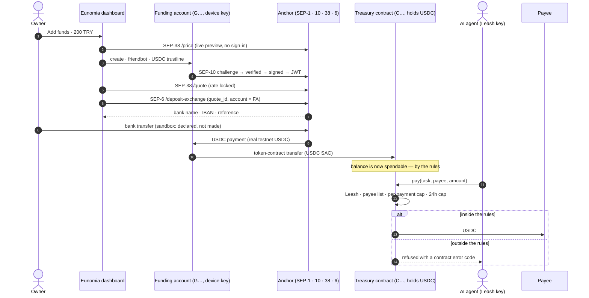
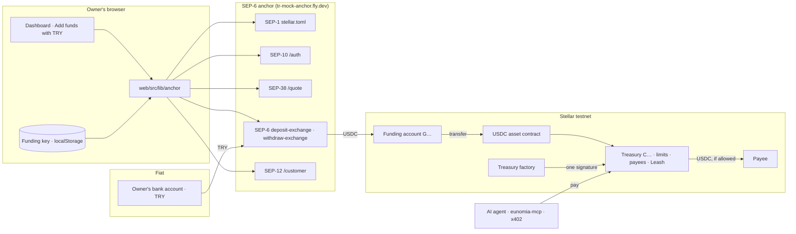

# The anchor leg — TRY in, a spendable agent budget out

An owner funds a Eunomia treasury with Turkish lira. The lira goes to a SEP-6 anchor, USDC
comes out on Stellar, and it lands inside a treasury contract where an AI agent can spend
it — inside the owner's limits, to approved payees only, with every refusal enforced by the
contract.

The anchor is in the payment path, not beside it: a USDC treasury has **no other way to be
funded** from the dashboard, and every agent payment it makes afterwards is that same USDC.

Anchor: [`tr-mock-anchor.fly.dev`](https://tr-mock-anchor.fly.dev) (TRY ⇄ USDC, Stellar
testnet, the Pro Hackathon sandbox). Code: [`web/src/lib/anchor/`](../web/src/lib/anchor).

## The trip, step by step

## The pieces

## What the integration is made of

| File | Job |
|---|---|
| `discover.ts` | SEP-1. Reads the toml into endpoints, signing key, issuer. Refuses a toml for another network and any endpoint without https. The only inputs are a home domain and an asset code. |
| `auth.ts` | SEP-10. Verifies the challenge **before** signing it: sequence 0, manage-data only, addressed to this account, for this home domain, signed by the toml's key. A payment dressed up as a challenge is refused (`auth.test.ts`). |
| `quotes.ts` | SEP-38. Indicative price for the live preview, firm quote for the transfer. |
| `transfers.ts` | SEP-6 `deposit-exchange` / `withdraw-exchange`, status polling, the SEP-12 payout IBAN. Anchor errors are surfaced in the anchor's own words. |
| `fundingAccount.ts` | The G-account between anchor and treasury: create, trustline, forward into the treasury, pay a withdrawal with its memo. |
| `addFunds.ts` | The two halves of a deposit, with progress: up to the bank details, then from the anchor's payment to the treasury. |
| `amounts.ts` | Decimal string ⇄ stroops without a float in between. |
| `live.test.ts` | The whole claim on testnet, on demand: `ANCHOR_LIVE=1 npx vitest run src/lib/anchor/live.test.ts`. |

UI: [`web/src/components/AddFundsTry.tsx`](../web/src/components/AddFundsTry.tsx), reached from
**Add funds** on any USDC treasury. End-to-end browser test:
[`web/tests/e2e/try-funding.spec.ts`](../web/tests/e2e/try-funding.spec.ts).

## Two constraints that shaped it

1. **The anchor signs in G-accounts only.** Its toml publishes no
   `WEB_AUTH_FOR_CONTRACTS_ENDPOINT` (SEP-45), so a passkey smart wallet — a C-address —
   cannot authenticate.
2. **The anchor pays out to G-accounts only.** Asked to deposit to a contract address it
   answers `400 'account' must be a Stellar G... or M... address (contract addresses are not
   supported)`.

Both the owner's wallet (when it is a passkey) and the treasury are C-addresses. Hence the
**funding account**: a G-keypair made on the owner's device, one per treasury. It signs in,
receives the USDC, and forwards it into the treasury in the next transaction. It is a
corridor, not a vault — it holds money only between those two transactions. A side effect
worth keeping: adding funds needs **no wallet prompt at all**, so a passkey owner never
meets a second ceremony.

If that trip is interrupted between the anchor's payment and the forward (a reload, a
dropped connection), the USDC waits in the funding account; the form looks for it every
time it opens and offers to move it in.

## What is simulated, and what is not

| | |
|---|---|
| The bank | **Simulated.** The sandbox has no bank; the incoming TRY transfer is declared through the anchor's `simulate-bank-transfer` endpoint. The UI labels that step as a sandbox step. With a production anchor the call disappears and the polling that follows does the rest. |
| KYC | **Simulated** by the anchor (auto-approved, no personal data). |
| The rate | Real: USD/TRY from the Reflector oracle plus a 50 bps spread, locked by a firm quote. |
| The USDC | Real testnet USDC (`USDC:GBBD47IF…FLA5`), paid on-chain by the anchor. |
| The treasury, the limits, the refusals | Real contracts on testnet. |

## Verified on testnet (2026-09-18)

One run of `live.test.ts`:

| Step | Evidence |
|---|---|
| USDC treasury created through the factory, one signature | [`CBPSHKOR…SQDO`](https://stellar.expert/explorer/testnet/contract/CBPSHKORMTWN2CK35LKFGMFRZVVGLKMKQTZGISAHJNV4FXGOIJXJSQDO) |
| 150 TRY → 3.0594136 USDC, paid by the anchor | [`0db8d770…1b34`](https://stellar.expert/explorer/testnet/tx/0db8d77093198f64d7ebc3b03628a34ef1a6c47d80e74b07298073c3427f1b34) |
| Forwarded into the treasury | [`aff042d1…411e`](https://stellar.expert/explorer/testnet/tx/aff042d153ff4e11295e310efdcc70f6ad81404452c003e7a56804a5a27d411e) |
| The agent pays an approved payee 1 USDC, on its own | [`7ff1d88e…0643`](https://stellar.expert/explorer/testnet/tx/7ff1d88ebd68730108e9a965f3e06e99f8cbb4f25f44d11fac59244390d00643) |
| The agent tries a stranger | refused by the contract: `PayeeNotWhitelisted (#2)` |

The off-ramp was probed with the same client calls: 1.5 USDC → 72.81 TRY, paid out over
(simulated) FAST, Stellar payment
[`82d5db94…cd43`](https://stellar.expert/explorer/testnet/tx/82d5db94dc77b9c757009acddc00f84a545f2cbedcea307933b0cd17348bcd43).
The library carries it (`requestWithdraw`, `setPayoutIban`, `payAnchor`); it has no screen yet.

## From the sandbox to a real anchor

The integration's inputs are `ANCHOR_HOME_DOMAIN` and the asset code. Moving to a production
SEP-6 anchor changes those two values and the network passphrase; the endpoints, signing key
and issuer are rediscovered from the new toml, and `token.ts` pins the new asset contract.
What does not carry over is `simulateBankTransfer` — by design, it is the one call with no
production counterpart.

Open on the anchor's side: SEP-45. With it, the smart wallet signs in itself and the funding
account goes away entirely.

## Sources used while building this

- The anchor's own guide: `https://tr-mock-anchor.fly.dev/llms-full.txt` and `/sep6/info`
- The cohort's integration skill: `yigitcangokmen/stellar-hackathon-turkiye` → `SKILL.md`
- The reference wallet: `kaankacar/tr-mock-wallet` → `index.html` (read for parameters; no code copied — it targets SDK 17, this repo is pinned to 16)
- SEP-6, SEP-10, SEP-38 texts for the `deposit-exchange` asset asymmetry and the challenge checks
