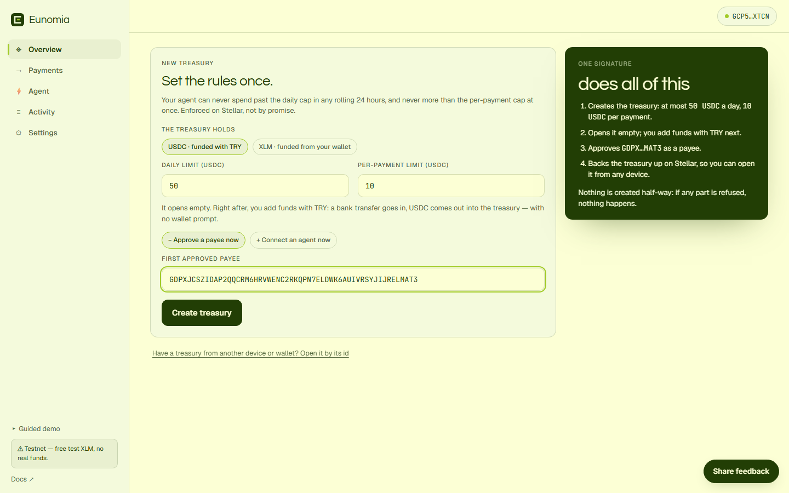
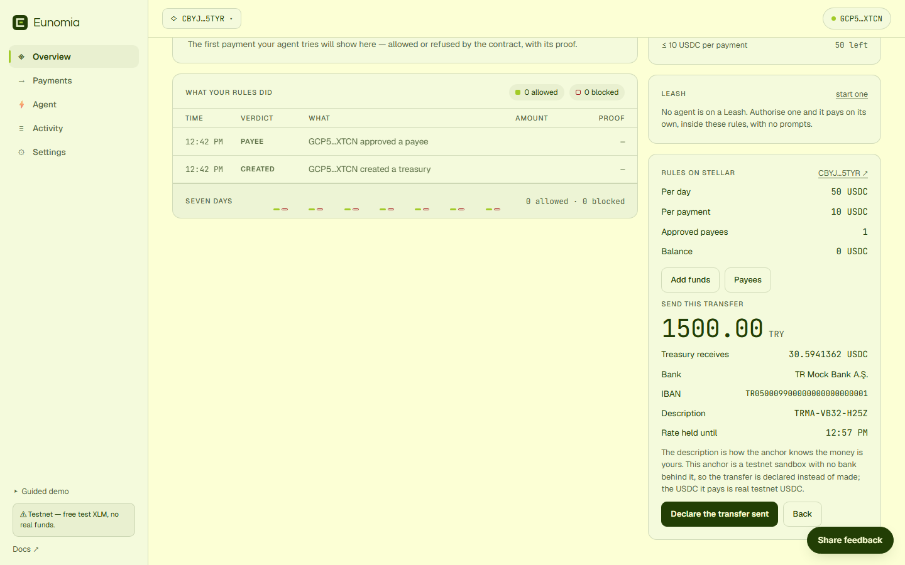
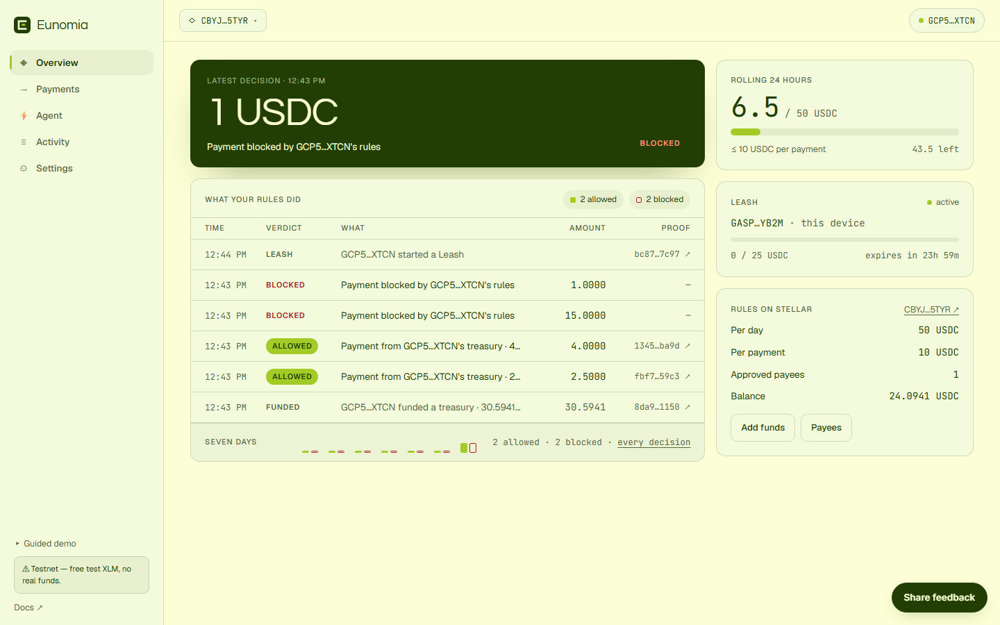
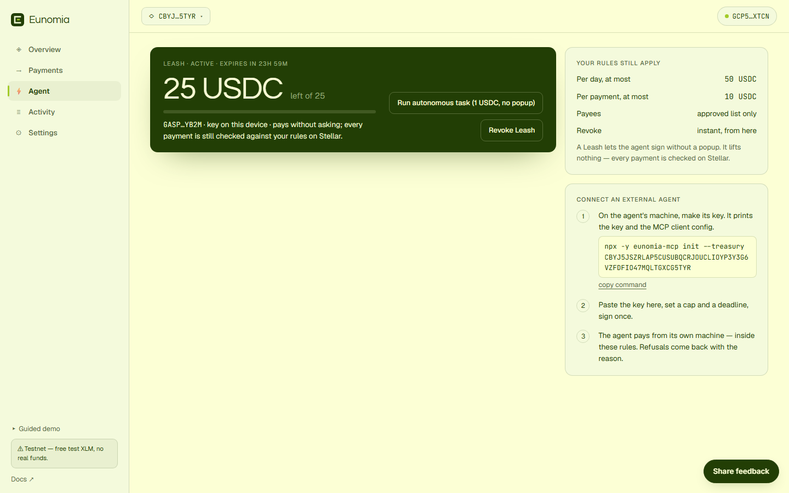

# Try Eunomia — a 5-Minute Guide (Testnet)

*Türkçe versiyon: [TRY-IT-TR.md](TRY-IT-TR.md)*

**What is Eunomia?** A bounded treasury on Stellar that lets you hand an AI agent real
spending power, safely: the daily limit, the per-payment limit and the list of approved
payees are enforced by the **contract** — no matter how hard the model is "persuaded", funds
can't leave the policy.

Everything below runs on **testnet**: no real money, zero risk. Every owner action is signed
by you — non-custodial, funds stay under your control the whole time.

**App:** [eunomia.finance](https://eunomia.finance)

## Two ways in

**With a passkey (fastest).** Face ID, a fingerprint or your device PIN. No wallet to
install, no seed phrase to write down, and no XLM to find first — the passkey controls a
Stellar smart wallet and transaction fees are sponsored. Works the same on a phone.

**With a wallet.** If you already have one: Freighter, xBull, Albedo, LOBSTR, Rabet or Hana
on desktop; any WalletConnect-capable Stellar wallet on a phone. Switch it to **Testnet** in
the wallet's own settings first. An empty wallet gets a one-click **"Get free testnet XLM"**
button (it needs a little for fees).

## Steps

1. **Sign in** — *Create your treasury with a passkey*, and confirm with your face,
   fingerprint or PIN. (Prefer a wallet? *I have a wallet* → pick yours. On a phone, choose
   **WalletConnect** and scan the QR.)
2. **Set the rules and create — one signature.** The treasury holds **USDC** (funded with
   TRY) unless you switch it to **XLM** (funded from your wallet). Enter a daily limit and a
   per-payment limit → *Create treasury* → confirm once. Two optional chips fold into that
   same signature: *+ Approve a payee now* and *+ Connect an agent now* (step 7).

   

3. **Add funds with TRY** — on **Overview**, *Add funds* → type an amount (50–3000 TRY) and
   watch what it buys → *Get bank details*: bank, IBAN, the transfer description and the time
   the rate is held until. This anchor is a testnet sandbox with no bank behind it, so you
   press *Declare the transfer sent* instead of sending one; the USDC it pays is real testnet
   USDC. A few seconds later it is in the treasury, with both transactions linked. No wallet
   prompt at any point. *(XLM treasury: Add funds → amount → Fund → confirm.)*

   

4. **Approve a payee** — on **Payments**, add an address that may be paid. No second address
   handy? Click **"use the sample vendor"**. *(In a USDC treasury a G… payee needs a USDC
   trustline to receive it — the sample vendor has one; a passkey wallet needs nothing.)*
5. **Send a payment** — *Pay by hand* → your approved address, an amount within the limits →
   it lands on-chain ✓ and appears in the ledger with its proof.
6. **Now watch the real show** — try an amount **over** your per-payment limit, or a payment
   to an address you never approved: the contract **rejects it on-chain** and funds never
   move. That rejection is the product working. 🔴

   

7. **Hand it to an agent (no more popups)** — on **Agent**:
   - *Quickest:* set a cap and a duration → **Start Leash**. A session key on this device now
     pays on its own — try **Run autonomous task**: it lands on-chain with zero popups, and
     every rule still applies.
   - *Your own agent (Claude, or any MCP client):* copy the command the page prints —
     `npx -y eunomia-mcp init --treasury <your id>` — run it on the agent's machine, paste the
     public key it prints, **Authorise agent**. The agent's secret never leaves its machine.
     The command also prints the config to add to your MCP client; from then on the agent has
     `check_budget`, `pay`, `request_exception` and friends — and refusals come back to it
     with the contract's own error codes.

   *Revoke Leash* takes control back instantly.

   

8. **Owner controls** — in **Settings**: *Pause spending* (freezes the agent; withdraw still
   works), *Withdraw* funds back out, *Update limits* live. The owner always has an exit. Your
   treasury is backed up on Stellar, so it opens by itself when you sign in with the same
   passkey or wallet on another device.

## If something goes wrong

- Errors are shown in plain language inside the app (insufficient balance, signature
  rejected, and so on).
- If a TRY transfer is interrupted (a reload, a dropped connection), nothing is lost: open
  *Add funds* again and the app offers to move the waiting USDC into the treasury.
- The **Share feedback** button (bottom right) opens a short form — two sentences there
  directly shape the roadmap. 🙏

## More

- Main [README](../README.md) — architecture, contracts, the ZK confidential mode
- [The anchor leg](ANCHOR.md) — how TRY becomes a spendable agent budget, with evidence
- [`eunomia-mcp`](../packages/mcp/README.md) — every tool the agent gets
- Spectator demo (no sign-in needed): **Guided demo** in the app's sidebar
